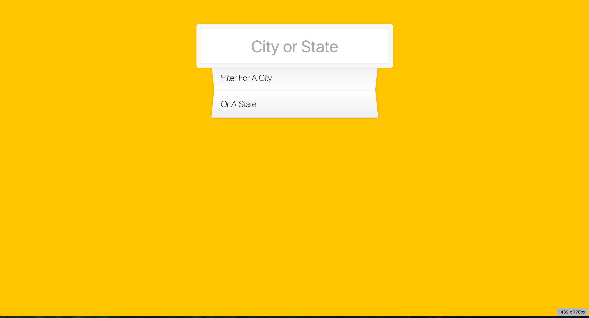

# JavaScript30

## [06 - Type Ahead](06 - Type Ahead/README.md) 

Learn how to send a HTTP request and use regular expression to filter the array.
* XMLHttpRequest
* Fetch API
* Promise
* Regular Expression
